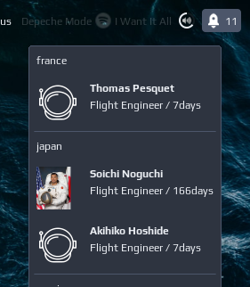

# noobie

This is a widget-maker tool - it creates a widget based on a JSON definition returned by a script. 
For example, if your script returns following JSON:

```json
{
  "widget": {
    "icon": "smile",
    "text": "noobie",
    "mouse_actions": {
      "on_right_click": "echo 'right click'"
    }
  }
}
```

noobie will convert it to the widget:

.

More complex example (from a [people-in-space](https://github.com/streetturtle/noobie-plugins/tree/master/people-in-space) plugin) with a menu, each menu item has an icon, title and subtitle:

.

For more examples check out plugins repository: [noobie-plugins](https://github.com/streetturtle/noobie-plugins)

## Features:

 - dropdown menu:
 
   
 
 - mouse actions (scroll up/down, right click);
 - icon could be either a local file, a [feathericons](https://feathericons.com/) icon or an image from URL;
 - a notification with details in case your script failed:
 
   
 
## Plugins

Check out existing plugins in this repo: https://github.com/streetturtle/noobie-plugins.

## Creating a plugin

Please consult a **noobie.schema.json** for details. Below are few important excerpts:

- `icon` of the widget or menu item can be one of 
  - a name of feathericons icon, you can get it here: [feathericons.com](https://feathericons.com/); 
  - an absolute path to the image file;
  - URL to the image file. If you are not sure image exists, you can add a `icon_fallback` field with an absolute path to the fallback image;
 - for a horizontal line in the menu add an item with title equals to '-', like  
    ```json
    { "title":  "-" }
    ```
  - for a header menu item set `header` field to true, note that the `icon` field will be ignored:
    ```json
    {
      "header": "true",
      "title": "Header Title"
    }
    ```
 
## Installation

1. Clone the repo under ~/.config/awesome/ folder
1. At the top of rc.lua add an import:
 
    ```lua
    local noobie_exmaple_1 = require("noobie")
    local noobie_exmaple_2 = require("noobie")
    ```
1. Add a widget to wibox and provide a path to your script:
 
    ```lua
    noobie_exmaple_1{ path = os.getenv("HOME") .. '/.config/awesome/noobie/test.sh' },
    noobie_exmaple_2{ path = os.getenv("HOME") .. '/.config/awesome/noobie/othertest.py' },
    ```
If your widget is static you can define it in a JSON file and use like this:

```lua
noobie_exmaple_1{ path = 'cat ' .. os.getenv("HOME") .. '/.config/awesome/noobie/test.json' },
```
    
# Troubleshooting

In case of any problem / issue / question:
 - create an [issue](https://github.com/streetturtle/noobie/issues/new/choose)
 - raise a question on [Discussions](https://github.com/streetturtle/noobie/discussions)!
 - ping me on AwesomeWM's discord, here's an [invite](https://discord.gg/XYvn8R5)

test
