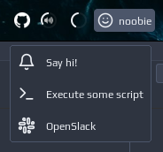

# noobie

Create a wibar widget for Awesome WM with no lua code!

This is widget-maker tool - it creates a widget based on a definition described in JSON format and returned by a script. 

For example, if your script returns a following JSON:

```json
{
  "widget": {
    "icon_path": "smile",
    "text": "noobie",
    "mouse_actions": {
      "on_scroll_up": "echo 'scroll up'",
      "on_scroll_down": "echo 'scroll down'",
      "on_right_click": "echo 'right click'"
    }
  }
}
```

noobie will convert it to following widget:

.

You can also create widgets with menu:

```json
{
  "widget": {
    "icon_path": "smile",
    "text": "noobie",
    "mouse_actions": {
      "on_scroll_up": "echo 'scroll up'",
      "on_scroll_down": "echo 'scroll down'",
      "on_right_click": "echo 'right click'"
    }
  },
  "menu": {
    "items": [
      {
        "icon": "bell",
        "title": "Say hi!",
        "onclick": "notify-send 'hi!'"
      },
      {
        "icon": "terminal",
        "title": "Execute some script",
        "onclick": "/tmp/somescript.sh"
      },
      {
        "icon": "slack",
        "title": "OpenSlack",
        "onclick": "xdg-open https://slack.com"
      }
    ]
  }
}
```

gives:



## Plugins

You can create your own scripts in any language, the only rule is - it should return a proper JSON. 
Or you can check existing plugins in this repo: https://github.com/streetturtle/noobie-plugins.

## Installation

1. Download the latest release under ~/.config/awesome/ folder
1. At the top of rc.lua add an import:

```lua
local noobie_exmaple = require("noobie")
```
1. Add a widget to wibox and provide a path to your script:

```lua
noobie{ path = os.getenv("HOME") .. '/.config/awesome/noobie/test.sh' },
```
